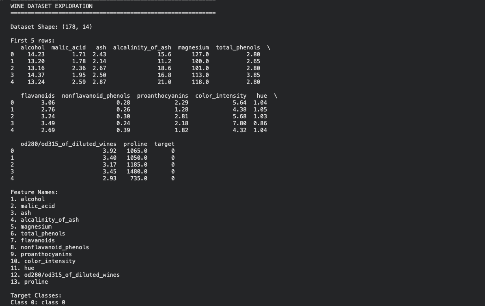
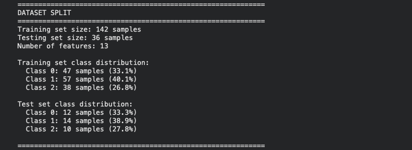
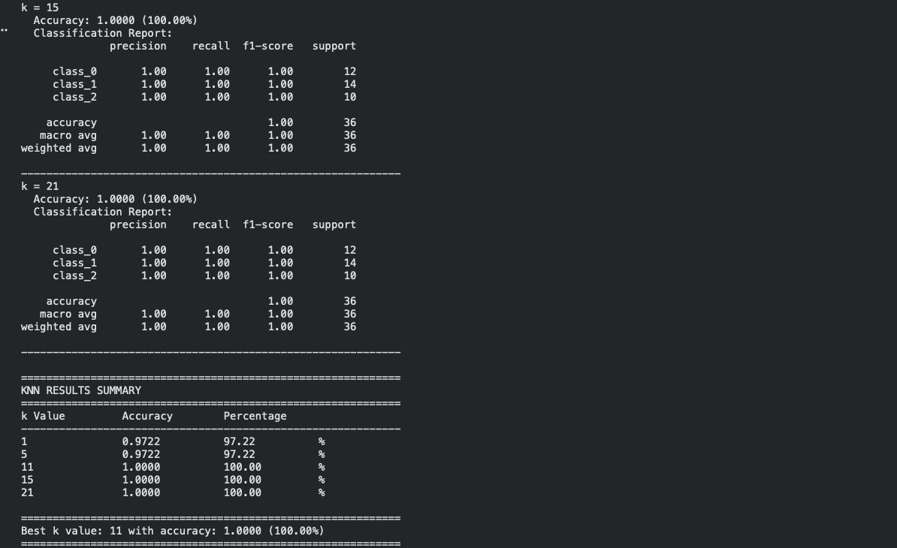
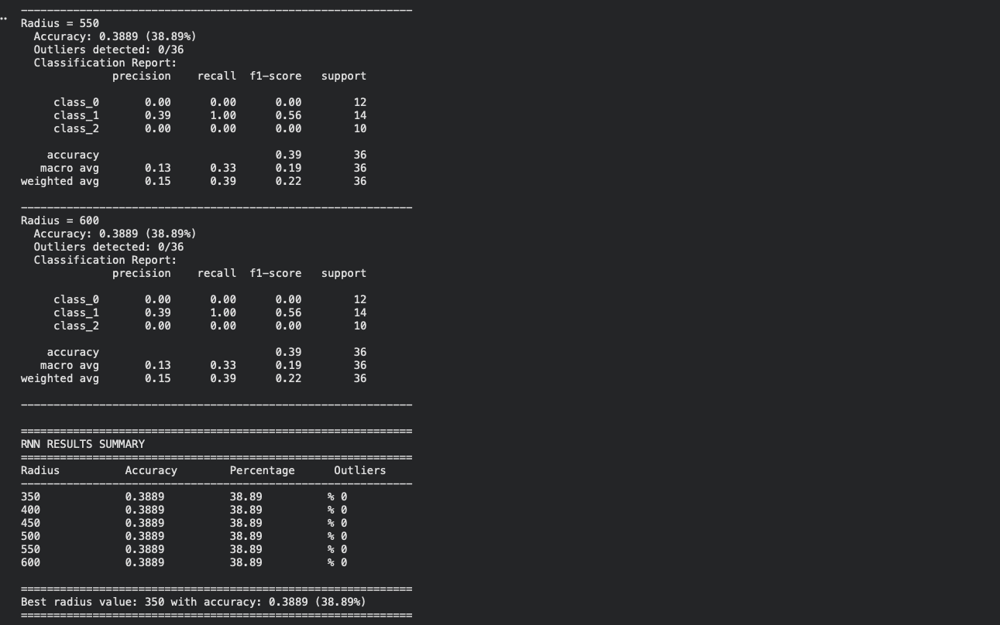
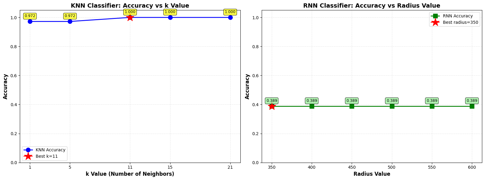
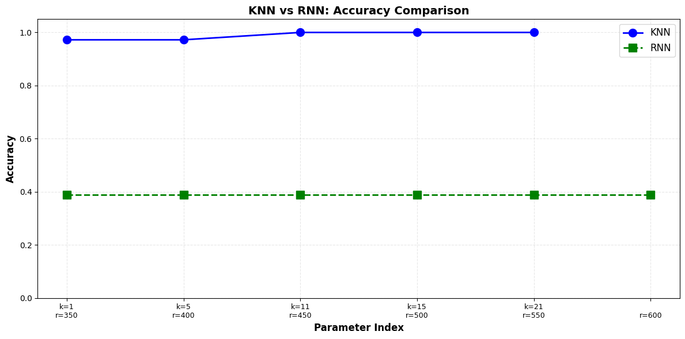
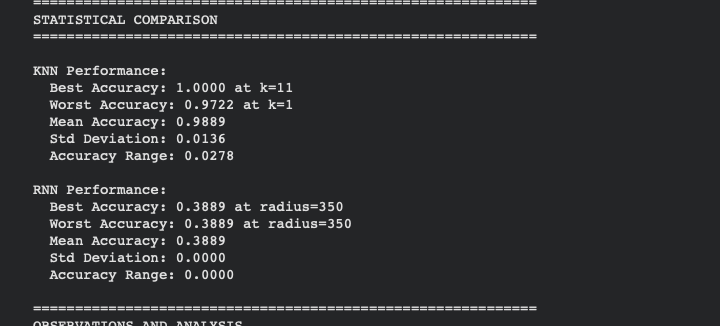

# Initial commit
# K-Nearest Neighbors (KNN) and Radius Neighbors (RNN) Classification Lab

## 📋 Table of Contents
- [Overview](#overview)
- [Objectives](#objectives)
- [Dataset](#dataset)
- [Requirements](#requirements)
- [Installation](#installation)
- [Lab Structure](#lab-structure)
- [How to Run](#how-to-run)
- [Expected Results](#expected-results)
- [Key Concepts](#key-concepts)
- [Troubleshooting](#troubleshooting)
- [References](#references)

---

## 🎯 Overview

This lab explores the performance of **K-Nearest Neighbors (KNN)** and **Radius Neighbors (RNN)** classifiers using the Wine Dataset from scikit-learn. 

---


##  Dataset

**Wine Dataset** (scikit-learn)
- **Samples**: 178 wine samples
- **Features**: 13 chemical properties
  - Alcohol, Malic acid, Ash, Alkalinity of ash, Magnesium, Total phenols, Flavanoids, Nonflavanoid phenols, Proanthocyanins, Color intensity, Hue, OD280/OD315 of diluted wines, Proline
- **Classes**: 3 wine cultivars (varieties)
- **Source**: UCI Machine Learning Repository

**Class Distribution**:
- Class 0: ~59 samples
- Class 1: ~71 samples
- Class 2: ~48 samples

---

## 🔧 Requirements

### Python Version
- Python 3.7 or higher

### Required Libraries
```
numpy>=1.19.0
pandas>=1.1.0
matplotlib>=3.3.0
scikit-learn>=0.24.0
```

---

## 💻 Installation

### Option 1: Using pip
```bash
pip install numpy pandas matplotlib scikit-learn
```

### Option 2: Using conda
```bash
conda install numpy pandas matplotlib scikit-learn
```

### Option 3: Using requirements.txt
Create a `requirements.txt` file:
```
numpy>=1.19.0
pandas>=1.1.0
matplotlib>=3.3.0
scikit-learn>=0.24.0
```

Then install:
```bash
pip install -r requirements.txt
```

---

## 📁 Lab Structure

The lab is divided into **4 main steps**:

### **Step 1: Load and Prepare the Dataset**
- Load Wine Dataset from sklearn
- Perform exploratory data analysis
- Display feature names and class distribution
- Split data into 80% training and 20% testing sets
- Use stratified splitting to maintain class balance

**Key Output**: Dataset statistics and split confirmation




---

### **Step 2: Implement K-Nearest Neighbors (KNN)**
- Standardize features using StandardScaler
- Train KNN classifiers with k values: [1, 5, 11, 15, 21]
- Evaluate each model on test set
- Record accuracy and classification metrics

**Key Output**: Accuracy table and best k value


**What is KNN?**
- Classifies based on the **k nearest neighbors**
- Uses majority voting among k neighbors
- Fixed number of neighbors regardless of distance

---

### **Step 3: Implement Radius Neighbors (RNN)**
- Use same scaled features from Step 2
- Train RNN classifiers with radius values: [350, 400, 450, 500, 550, 600]
- Handle outliers (samples with no neighbors in radius)
- Evaluate each model on test set

**Key Output**: Accuracy table with outlier counts and best radius value


**What is RNN?**
- Classifies based on **all neighbors within a fixed radius**
- Uses majority voting among neighbors in radius
- Variable number of neighbors based on distance threshold

---

### **Step 4: Visualize and Compare Results**
- Create accuracy trend plots for KNN
- Create accuracy trend plots for RNN
- Generate side-by-side comparison
- Provide statistical analysis
- Discuss when to use each algorithm

**Key Output**: 3 visualization plots and comprehensive analysis





---

##  How to Run

### Method 1: Jupyter Notebook (Recommended)
1. Open Jupyter Notebook:
   ```bash
   jupyter notebook
   ```
2. Create a new notebook
3. Add a Markdown cell with your name and lab info
4. Copy and paste each step's code into separate cells
5. Run cells sequentially (Shift + Enter)

### Method 2: Python Script
1. Combine all steps into a single `.py` file
2. Run from terminal:
   ```bash
   python wine_classification_lab.py
   ```

### Method 3: Google Colab
1. Go to [Google Colab](https://colab.research.google.com)
2. Create a new notebook
3. Paste code cells and run

---

##  Expected Results

### KNN Performance
- **Typical Best k**: Between 5-15
- **Expected Accuracy Range**: 70-100%
- **Trend**: May decrease with very large k values due to over-smoothing

### RNN Performance
- **Typical Best Radius**: 450-600 (depends on feature scaling)
- **Expected Accuracy Range**: 0-100%
- **Trend**: Increases with radius up to a point, then plateaus
- **Challenge**: Small radius values may fail due to outliers


### Overall Winner
- **Generally**: KNN tends to be more consistent
- **Best Case**: Both can achieve similar high accuracy with optimal parameters


---

## 🧠 Key Concepts

### Feature Scaling
**Why It's Important**:
- KNN and RNN are **distance-based** algorithms
- Features with larger scales dominate distance calculations
- StandardScaler ensures all features contribute equally

**Formula**:
```
scaled_value = (value - mean) / standard_deviation
```

### KNN vs RNN Decision Guide

**Use KNN When**:
- Data density varies across feature space
- You want consistent performance
- Simpler parameter tuning is needed
- You know approximate optimal neighbor count

**Use RNN When**:
- Data is uniformly distributed
- Distance thresholds have physical meaning
- Outlier detection is important
- You want to exclude very distant neighbors

### Parameter Selection

**KNN - Choosing k**:
- **Small k (1-3)**: High variance, low bias, may overfit
- **Medium k (5-15)**: Good balance
- **Large k (>20)**: Low variance, high bias, may underfit

**RNN - Choosing Radius**:
- **Small radius**: May have many outliers
- **Optimal radius**: Includes enough neighbors for stable predictions
- **Large radius**: Similar to large k in KNN

---

## 🔍 Troubleshooting

### Issue: "ModuleNotFoundError: No module named 'sklearn'"
**Solution**: Install scikit-learn
```bash
pip install scikit-learn
```

### Issue: RNN shows 0% accuracy for small radius values
**Solution**: This is expected! Small radius values create too many outliers. The code handles this gracefully. Try larger radius values.

### Issue: Plots not displaying in Jupyter
**Solution**: Add this at the top of your notebook:
```python
%matplotlib inline
```

### Issue: Different results each time
**Solution**: Ensure `random_state=42` is used in train_test_split

### Issue: Memory error with large datasets
**Solution**: The Wine dataset is small (178 samples), so this shouldn't occur. If it does, restart your kernel.

---

## 📚 References

### Scikit-learn Documentation
- [KNeighborsClassifier](https://scikit-learn.org/stable/modules/generated/sklearn.neighbors.KNeighborsClassifier.html)
- [RadiusNeighborsClassifier](https://scikit-learn.org/stable/modules/generated/sklearn.neighbors.RadiusNeighborsClassifier.html)
- [Wine Dataset](https://scikit-learn.org/stable/modules/generated/sklearn.datasets.load_wine.html)

### Academic Papers
- Forina, M. et al. (1991). "PARVUS - An Extendible Package for Data Exploration, Classification and Correlation"
- Fix, E. and Hodges, J.L. (1951). "Discriminatory Analysis: Nonparametric Discrimination"

### Additional Learning Resources
- [K-Nearest Neighbors Tutorial](https://scikit-learn.org/stable/modules/neighbors.html)
- [Understanding Distance Metrics](https://scikit-learn.org/stable/modules/generated/sklearn.metrics.pairwise_distances.html)

---


